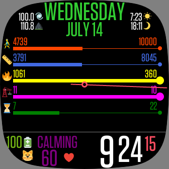

# FitBit Stats Clock Face

Stats clock face for [Fitbit Sense](https://www.fitbit.com/global/us/products/smartwatches/sense). Bought from [Fitbit Sense | Ebest](https://www.ebest.cl/fitbit-sense.html).

## Features

- **Date & Time**: Clean and simple time display is always available.

## Built With

- [Fitbit SDK](https://dev.fitbit.com/getting-started/) - To develop applications or clock faces for Fitbit devices.
- [Fitbit OS Simulator](https://dev.fitbit.com/release-notes/fitbit-os-simulator/) - To see the application or clock faces on a local simulator.
- [Visual Studio Code](https://code.visualstudio.com/insiders/).
  - [ESLint](https://marketplace.visualstudio.com/items?itemName=dbaeumer.vscode-eslint).
  - [Prettier - Code formatter](https://marketplace.visualstudio.com/items?itemName=esbenp.prettier-vscode).
  - [Visual Studio IntelliCode](visualstudioexptteam.vscodeintellicode).
  - [vscode-icons](vscode-icons-team.vscode-icons).

### Libraries

- [Fitbit SDK CLI](https://www.npmjs.com/package/@fitbit/sdk-cli): Fitbit SDK CLI is a command line tool for debugging Fitbit OS apps and clock faces.
- [Fitbit SDK Toolchain](https://www.npmjs.com/package/@fitbit/sdk): The Fitbit SDK Toolchain is used to build Fitbit OS apps and clock faces.
- [Sunrise-Sunset-Js](https://www.npmjs.com/package/sunrise-sunset-js): Calculate sunrise and sunset times in Javascript.

## Authors

- **Diego Urrutia-Astorga** (mika.cl AT gmail DOT com).
  - Github: [godiecl](https://github.com/godiecl).
  - Webpage: [https://godie.cl](https://godie.cl).
  - Twitter: [@godiecl](https://twitter.com/godiecl).

## License

This code is licensed under the [MIT License](./LICENSE).
